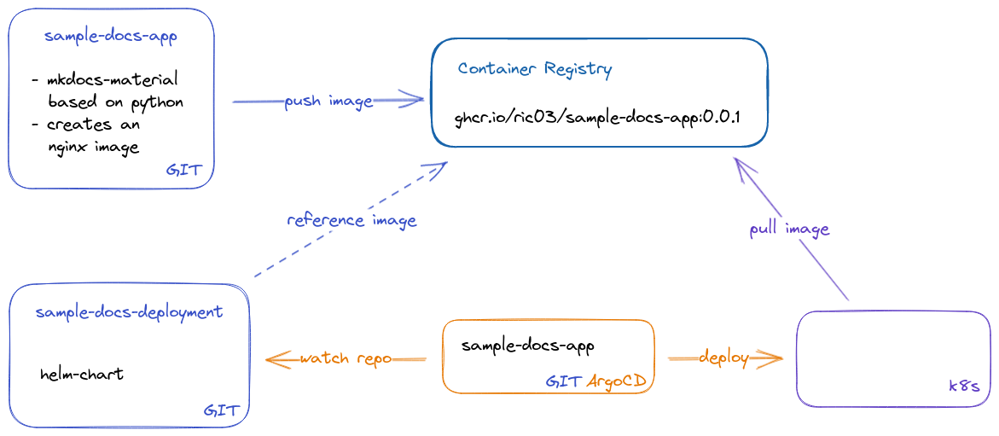

# Sample Docs ArgoCD

This repo contains the application/-set objects for ArgoCD.

# Component Overview

- The app: https://github.com/ric03/sample-docs-app
- The k8s config: https://github.com/ric03/sample-docs-deployment
- The ArgoCD config: https://github.com/ric03/sample-docs-argocd (this repo)

<picture>
  <source media="(prefers-color-scheme: dark)" srcset="docs/component-overview-transparent-darkmode.png">
  
</picture>

# Usage

Make sure that you are logged in. `argocd login localhost:8080`

Create a new Application using a yaml file.

```shell
argocd app create -f sample-docs-app.yaml
argocd app get sample-docs-app
```


# Setting up a local Kubernetes and ArgoCD

# CLI tools

```
sudo pacman -S kubectl kubens argocd helm
```

# Setting up kubernetes locally, using [kind](https://kind.sigs.k8s.io/)

Installation

```shell
curl -Lo ./kind https://kind.sigs.k8s.io/dl/v0.17.0/kind-linux-amd64
chmod +x ./kind
sudo mv ./kind /usr/local/bin/kind
```

Create a cluster

```
kind create cluster
```

kind starts a docker-container, the default cluster is kind-kind, and adds the cluster config to `~/.kube/config`

```
kubectl cluster-info --context kind-kind
```

Loading an image into the cluster

```
kind load docker-image <my-custom-image-0> <my-custom-image-1>
```

# Install ArgoCD

https://argo-cd.readthedocs.io/en/stable/getting_started/

Install the CRD

```
kubectl create namespace argocd
kubectl apply -n argocd -f https://raw.githubusercontent.com/argoproj/argo-cd/stable/manifests/install.yaml
```

Access The Argo CD API Server; By default, the Argo CD API server is not exposed with an external IP.

```
kubectl port-forward svc/argocd-server -n argocd 8080:443
```

First get the password; The initial password for the admin account is auto-generated and stored as clear text in a
secret

```
kubectl -n argocd get secret argocd-initial-admin-secret -o jsonpath="{.data.password}" | base64 -d; echo
```

Login Using The CLI (default username: admin)

```
argocd login localhost:8080
username: admin
password: <from previous command (secret)>
```

alternatively got to `localhost:8080` in your browser; A Warning due to a self-signed certificate may appear.

# Deploying first app with ArgoCD

```
kubeclt create namespace playground
```

Set the current namespace to `argocd`

```
kubens argocd
```

Add 'guestbook' app

```
argocd app create guestbook --repo https://github.com/argoproj/argocd-example-apps.git --path guestbook --dest-server https://kubernetes.default.svc --dest-namespace playground
```

Get status of 'guestbook'

```
argocd app get guestbook
```

Apply changes and sync with repo

```
argocd app sync guestbook
```
